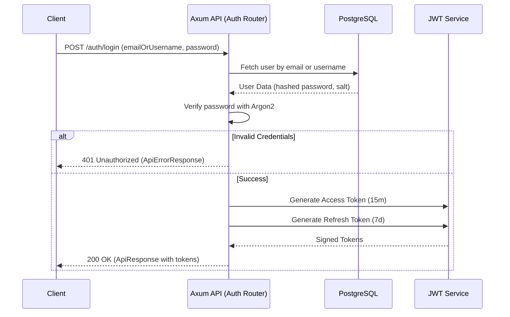
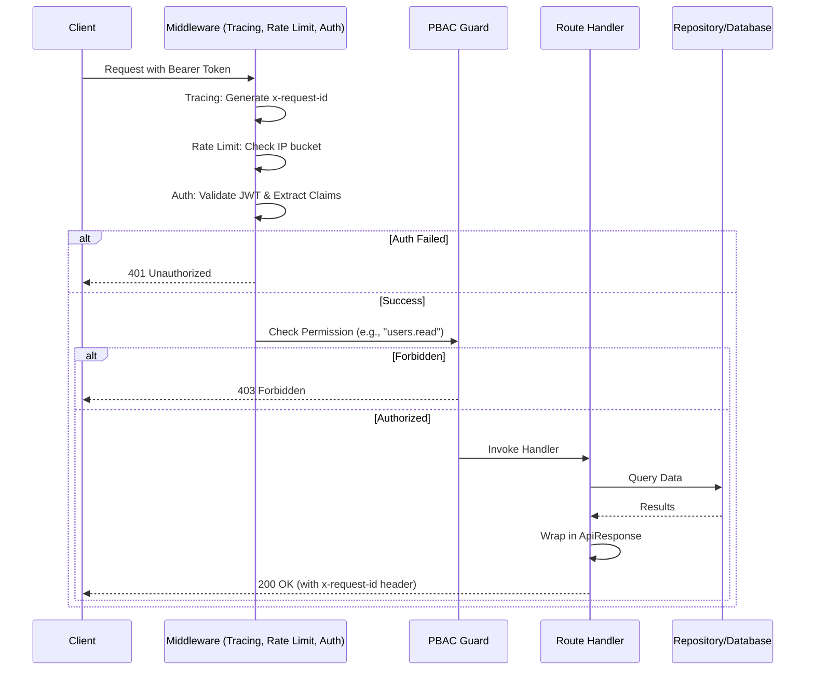

# System Sequence Diagrams

## Authentication Flow (Login)

```mermaid
sequenceDiagram
    participant Client
    participant API as Axum API (Auth Router)
    participant DB as PostgreSQL
    participant JWT as JWT Service

    Client->>API: POST /auth/login (emailOrUsername, password)
    API->>DB: Fetch user by email or username
    DB-->>API: User Data (hashed password, salt)
    API->>API: Verify password with Argon2

    alt Invalid Credentials
        API-->>Client: 401 Unauthorized (ApiErrorResponse)
    else Success
        API->>JWT: Generate Access Token (15m)
        API->>JWT: Generate Refresh Token (7d)
        JWT-->>API: Signed Tokens
        API-->>Client: 200 OK (ApiResponse with tokens)
    end
```

## Authorization & Request Processing

```mermaid
sequenceDiagram
    participant Client
    participant MW as Middleware (Tracing, Rate Limit, Auth)
    participant Guard as PBAC Guard
    participant Handler as Route Handler
    participant DB as Repository/Database

    Client->>MW: Request with Bearer Token
    MW->>MW: Tracing: Generate x-request-id
    MW->>MW: Rate Limit: Check IP bucket
    MW->>MW: Auth: Validate JWT & Extract Claims

    alt Auth Failed
        MW-->>Client: 401 Unauthorized
    else Success
        MW->>Guard: Check Permission (e.g., "users.read")
        alt Forbidden
            Guard-->>Client: 403 Forbidden
        else Authorized
            Guard->>Handler: Invoke Handler
            Handler->>DB: Query Data
            DB-->>Handler: Results
            Handler->>Handler: Wrap in ApiResponse
            Handler-->>Client: 200 OK (with x-request-id header)
        end
    end
```
