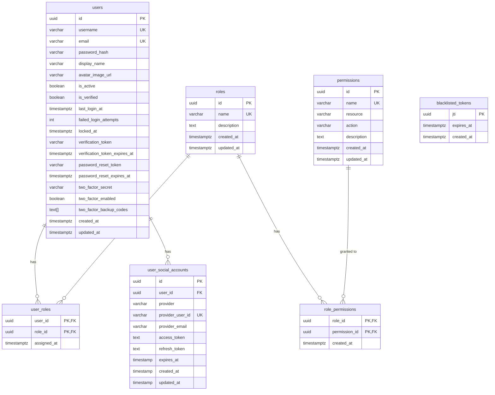
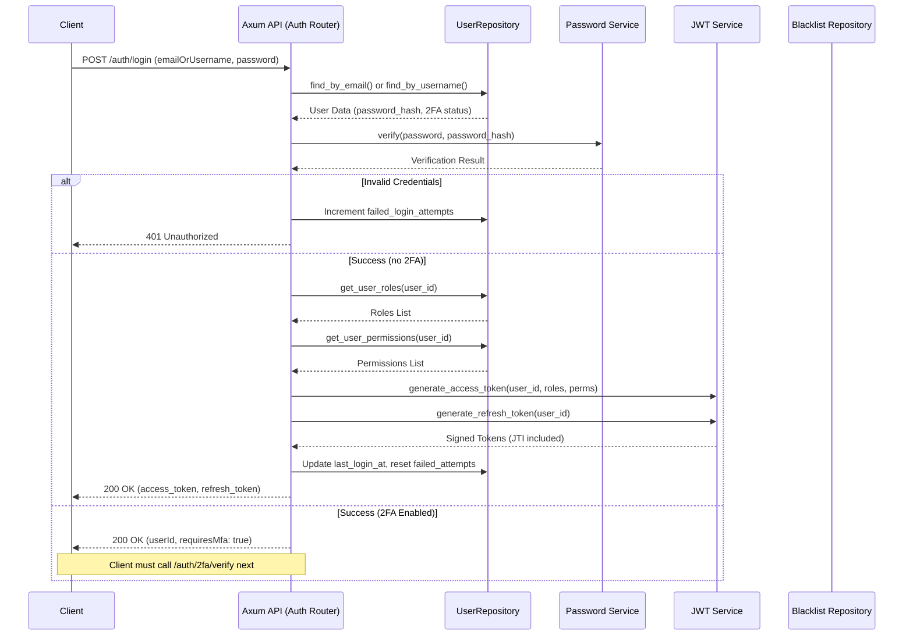
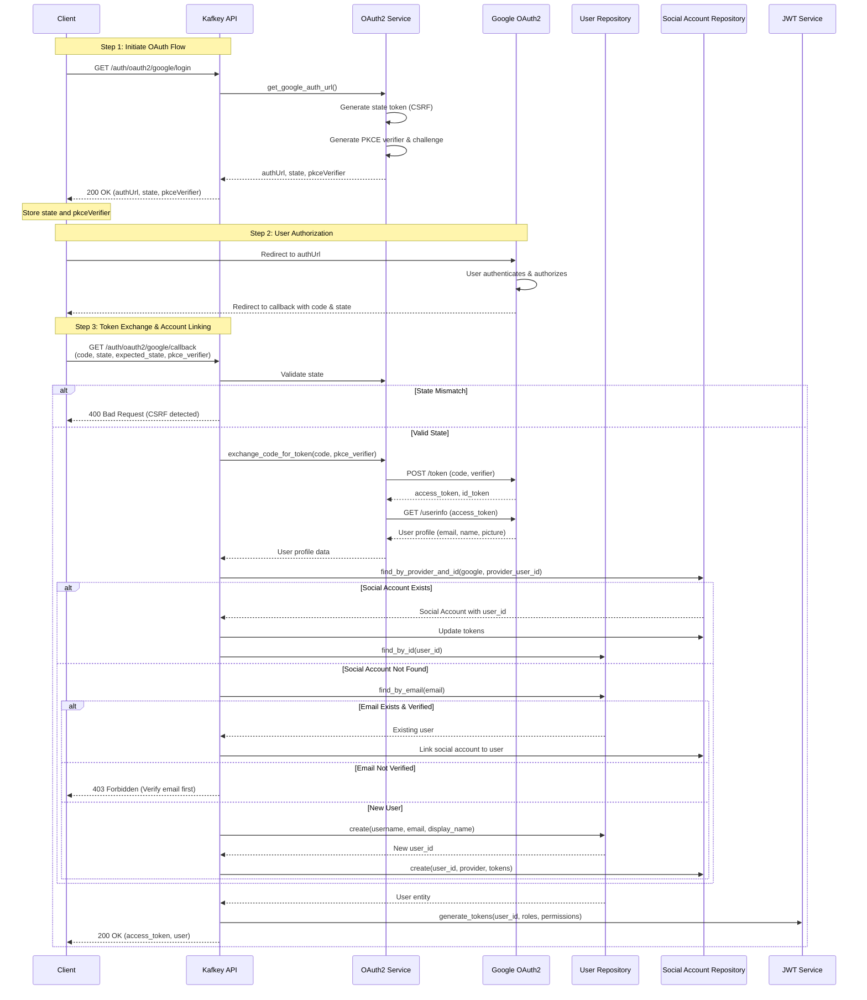
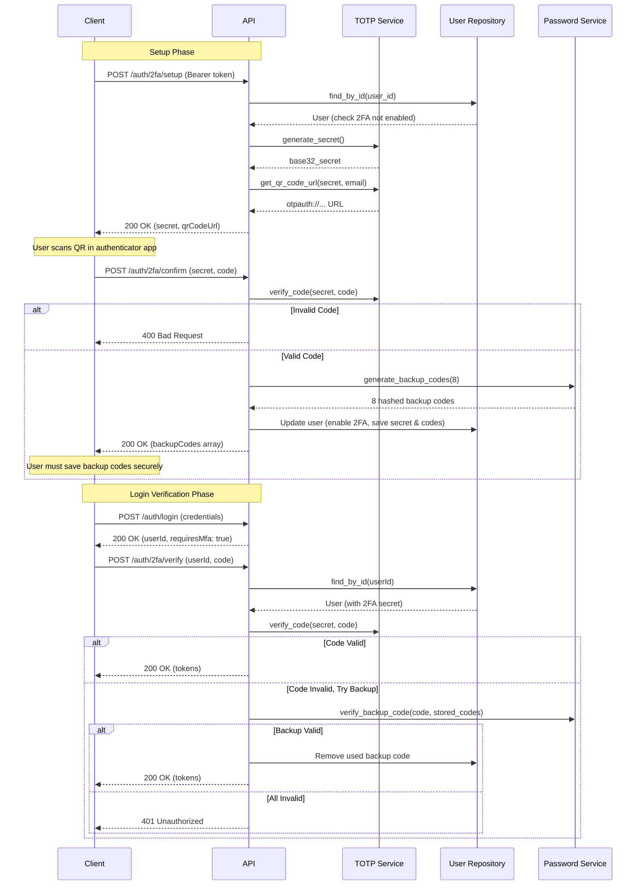
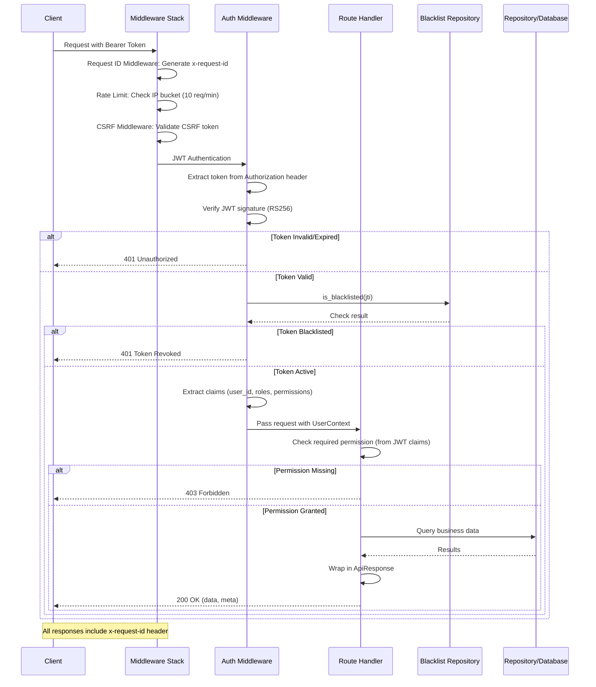
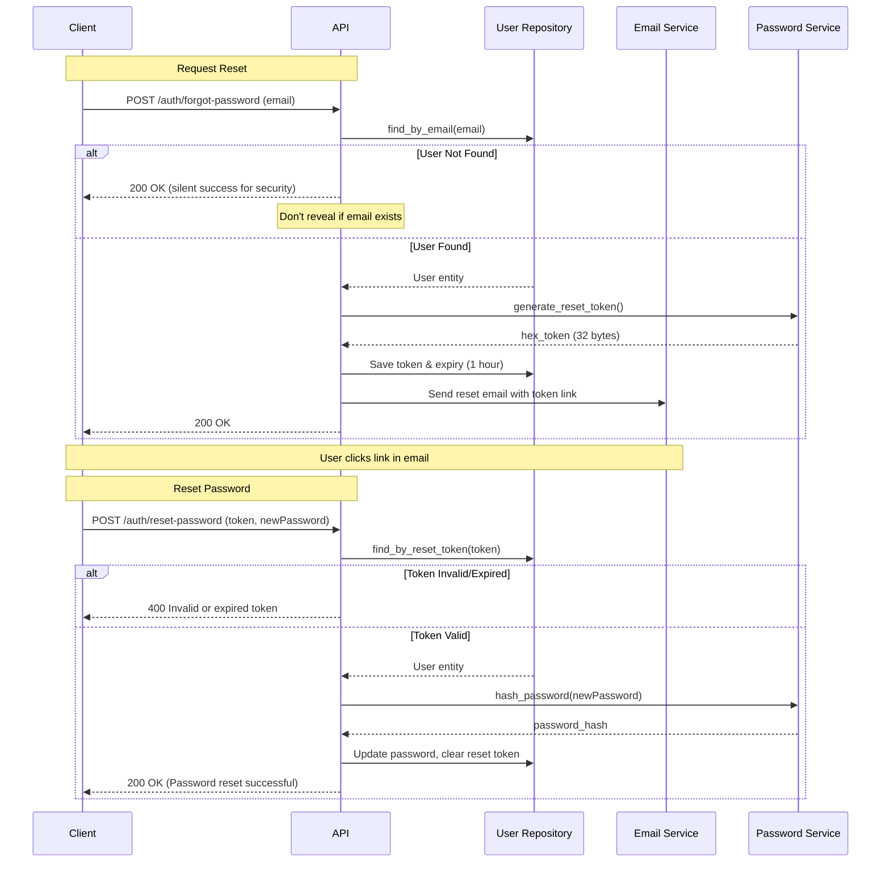
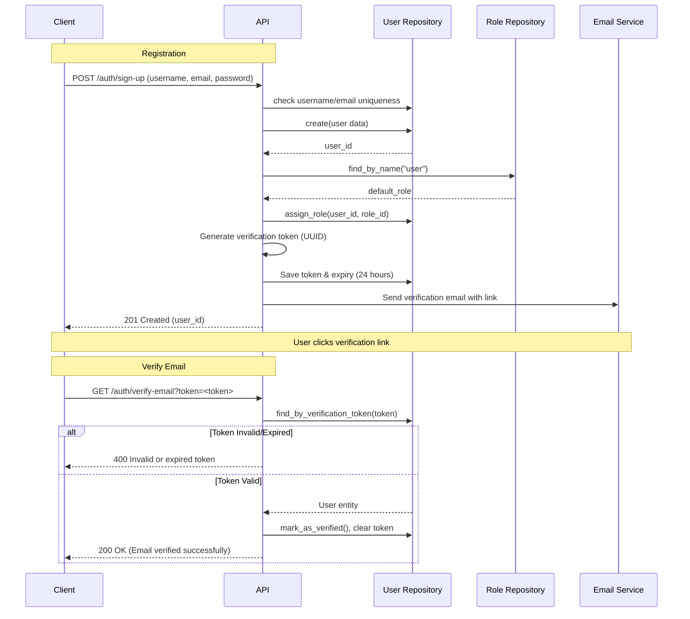
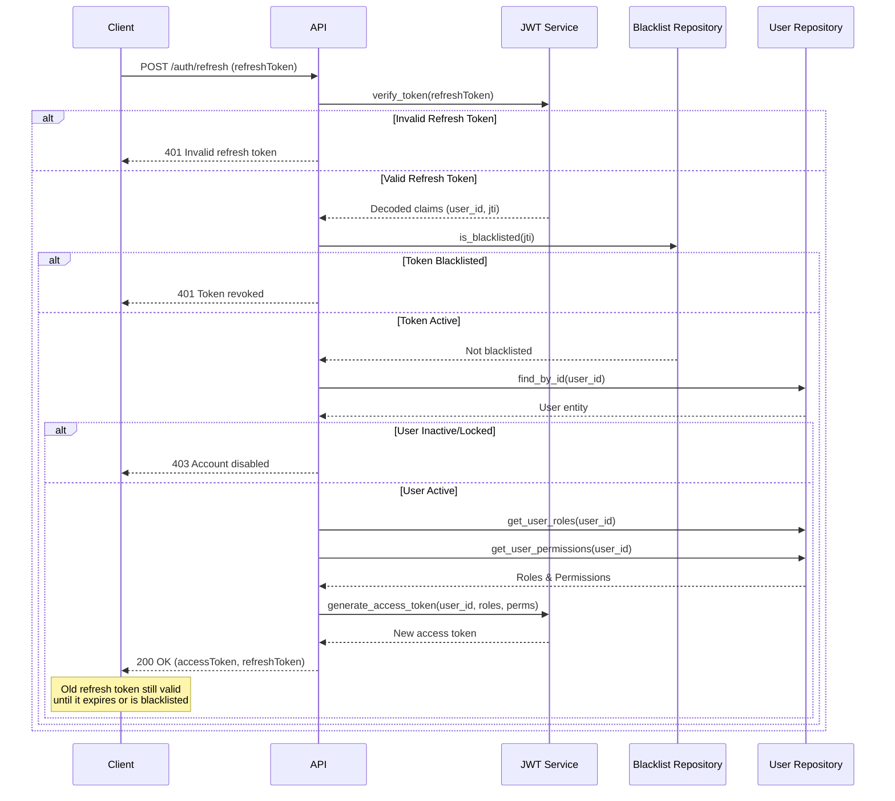

# System Diagrams

This document contains visual representations of the Kafkey API system architecture, flows, and data models using Mermaid diagrams.

## Table of Contents

- [Architecture Diagrams](#architecture-diagrams)
  - [System Architecture](#system-architecture)
  - [Database Entity Relationship Diagram](#database-entity-relationship-diagram)
- [Authentication \u0026 Authorization](#authentication--authorization)
  - [Standard Login Flow](#standard-login-flow)
  - [OAuth2 Login Flow (Google)](#oauth2-login-flow-google)
  - [2FA Setup and Verification](#2fa-setup-and-verification)
  - [Request Authorization Flow](#request-authorization-flow)
- [Security Flows](#security-flows)
  - [Password Reset Flow](#password-reset-flow)
  - [Email Verification Flow](#email-verification-flow)
  - [JWT Token Refresh](#jwt-token-refresh)

---

## Architecture Diagrams

### System Architecture

High-level overview of the Kafkey API system components and their interactions.

```mermaid
graph TB
    subgraph "Client Layer"
        Client[Web/Mobile Client]
    end

    subgraph "API Layer - Axum Framework"
        Router[Axum Router]
        Middleware[Middleware Stack]
        Handlers[Route Handlers]
    end

    subgraph "Middleware Stack"
        RequestID[Request ID]
        RateLimit[Rate Limiter]
        CSRF[CSRF Protection]
        Auth[JWT Auth]
        Metrics[Prometheus Metrics]
        Tracing[Sentry Tracing]
    end

    subgraph "Application Layer"
        UseCases[Use Cases]
        Services[Services Layer]
    end

    subgraph "Services"
        JWTService[JWT Service]
        OAuth2Service[OAuth2 Service]
        PasswordService[Password Service]
        TOTPService[TOTP Service]
    end

    subgraph "Domain Layer"
        Entities[Domain Entities]
        Repos[Repository Interfaces]
    end

    subgraph "Infrastructure Layer"
        PostgresRepos[PostgreSQL Repositories]
        MongoRepos[MongoDB Repositories]
    end

    subgraph "Data Stores"
        Postgres[(PostgreSQL<br/>Primary Data)]
        MongoDB[(MongoDB<br/>Audit Logs)]
    end

    subgraph "External Services"
        GoogleOAuth[Google OAuth2]
        GitHubOAuth[GitHub OAuth2]
        Prometheus[Prometheus<br/>Monitoring]
        Sentry[Sentry<br/>Error Tracking]
    end

    Client --> Router
    Router --> Middleware
    Middleware --> RequestID --> RateLimit --> CSRF --> Auth --> Metrics --> Tracing
    Tracing --> Handlers
    Handlers --> UseCases
    UseCases --> Services
    UseCases --> Repos
    Services --> JWTService & OAuth2Service & PasswordService & TOTPService
    Repos --> PostgresRepos & MongoRepos
    PostgresRepos --> Postgres
    MongoRepos --> MongoDB
    OAuth2Service -.-> GoogleOAuth & GitHubOAuth
    Metrics -.-> Prometheus
    Tracing -.-> Sentry

    style Client fill:#e1f5ff
    style Postgres fill:#336791
    style MongoDB fill:#4DB33D
    style GoogleOAuth fill:#4285F4
    style GitHubOAuth fill:#181717
    style Prometheus fill:#E6522C
    style Sentry fill:#362D59
```

---

### Database Entity Relationship Diagram

PostgreSQL database schema showing relationships between tables.

---

## Authentication & Authorization

### Standard Login Flow

Traditional username/password authentication with JWT token generation.

---

### OAuth2 Login Flow (Google)

Social login using Google OAuth2 with PKCE and state validation.

---

### 2FA Setup and Verification

Two-factor authentication setup and login verification flow.

---

### Request Authorization Flow

Token-based authorization with permission checking from JWT claims.

> [!TIP]
> This flow uses **Token-Based Authorization**. Permissions are embedded in the JWT during login, so subsequent requests **skip the database** for maximum performance.

---

## Security Flows

### Password Reset Flow

Secure password reset using time-limited tokens sent via email.

---

### Email Verification Flow

Email verification flow for new user registrations.

---

### JWT Token Refresh

Refreshing an expired access token using a valid refresh token.

---

## Monitoring & Observability Flow

```mermaid
graph LR
    subgraph "Request Flow"
        Request[HTTP Request]
        RequestID[Request ID Middleware]
        Tracing[Sentry Middleware]
        Prometheus[Prometheus Metrics]
        Handler[Business Logic]
    end

    subgraph "Observability Stack"
        Logs[Structured Logs]
        Metrics[Metrics Store]
        APM[Sentry APM]
        Audit[Audit Logs MongoDB]
    end

    Request --> RequestID
    RequestID --> Tracing
    Tracing --> Prometheus
    Prometheus --> Handler

    Handler -.Log Context.-> Logs
    Handler -.Record Metric.-> Metrics
    Handler -.Trace Span.-> APM
    Handler -.Audit Event.-> Audit

    Logs -.Query Logs.-> Operator[DevOps/SRE]
    Metrics -.Dashboards.-> Operator
    APM -.Error Tracking.-> Operator
    Audit -.Compliance Reports.-> Operator

    style Request fill:#e1f5ff
    style Logs fill:#FFA500
    style Metrics fill:#E6522C
    style APM fill:#362D59
    style Audit fill:#4DB33D
```

---

**Last Updated**: February 2026
