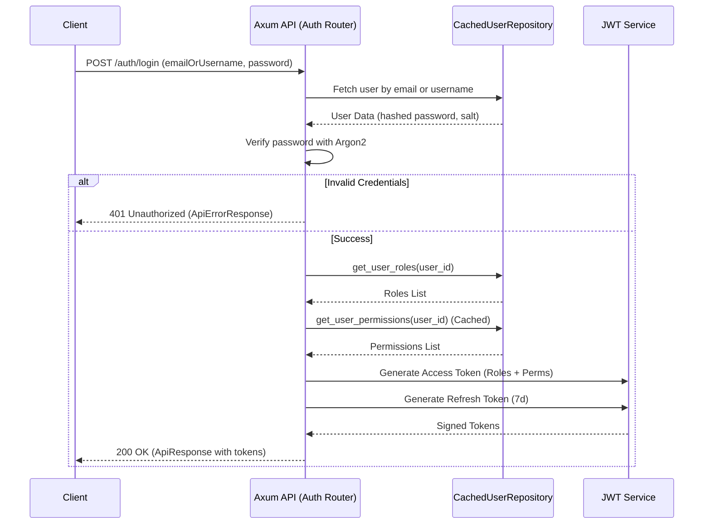
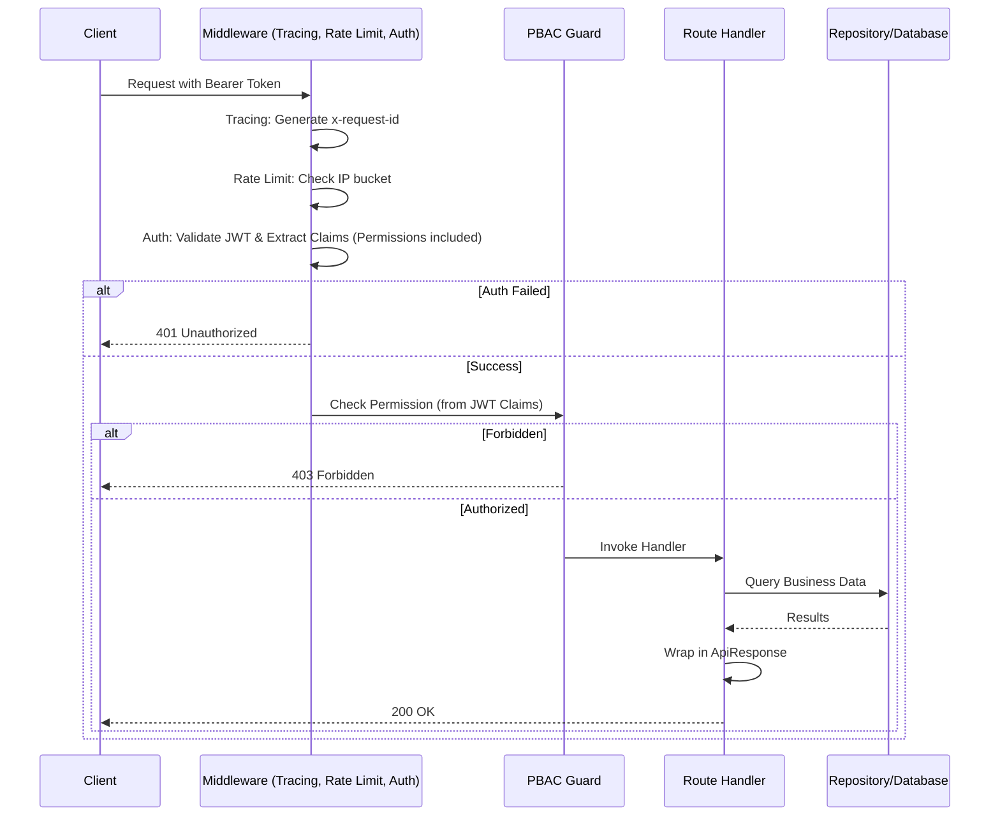

# System Sequence Diagrams

## Authentication Flow (Login)

## Authorization & Request Processing

> [!TIP]
> This flow uses **Token-Based Authorization**. Permissions are embedded in the JWT during login (using the Cache), so subsequent requests **skip both the DB and the Cache** for maximum performance.

